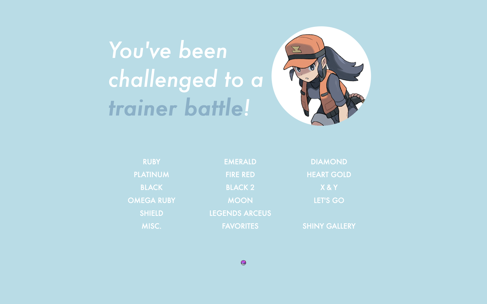
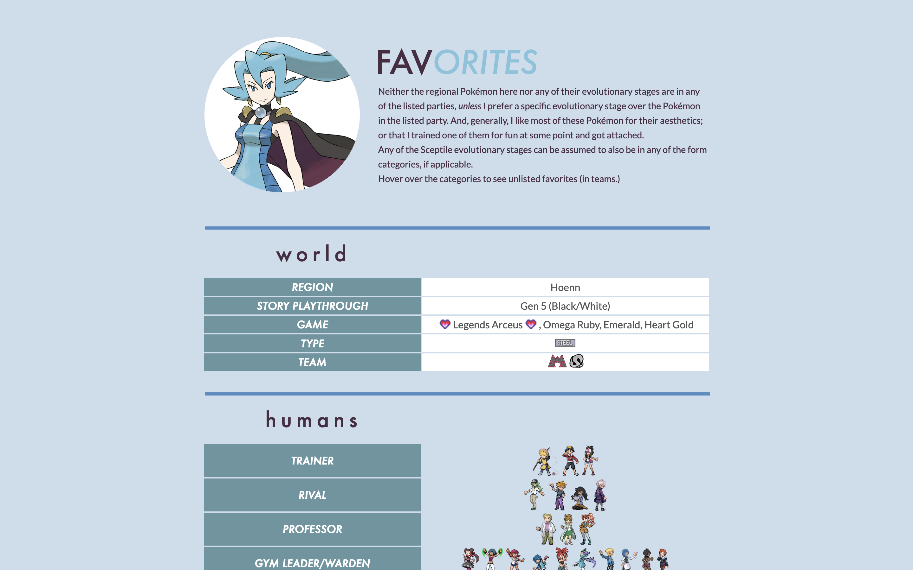

# Masterball (icirr.us)

Repository for my Pok&eacute;mon website. Been online since February 2017, started archiving my changes in October 2024.

This is a website that serves to log with my history with the Pok&eacute;mon franchise&mdash; as an avid player since 2004, it eventually occurred to me that it would be pretty neat to preserve all of my parties across each game onto a website. So this is what that's for, along with some fun stuff about me and a small Pok&eacute;mon Go section. This website is always subject to change as time goes on.

As of 2024, I have also discovered a new time waster in Pok&eacute;Rogue, and have decided to make the "button" part of the index link to an archive of those parties. So be on the look out for that! (I also need more runs to have worth archiving, anyway.)

Features
- Entirely hardcoded
- Image heavy
- Sprites from Pok&eacute;mon Showdown
- Light Javascript

# Changelog

### 23 October 2024 
And it's on GitHub! Might take a moment for me to push it to GitHub too - I realized recently how much easier it would be if I did all my website fiddling locally and pushed my changes this way. Especially as it's been 7 years since this thing's existed.

# Gallery

### Latest Design

## Overview

# Future Plans
- Pok&eacute;Rogue section
- Responsive! I've been putting off this one for years lol
- Mostly I need to play more (haven't played USUM or SV yet though I own a game from each release; also Pok&eacute;mon Go when I feel like it) so I can add more